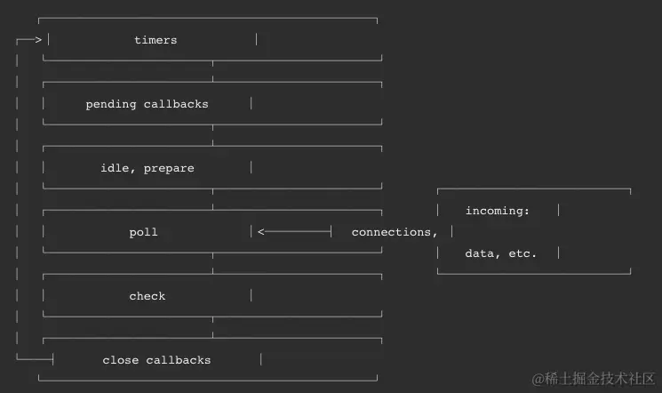

# 事件循环
事件循环是一种机制，它会不断的轮询任务队列，并将队列中的任务依次执行。

JavaScript的任务分为两种**同步**和**异步**：

-   **同步任务**：在主线程上排队执行的任务，只有一个任务执行完毕，才能执行下一个任务，
-   **异步任务**：不进入主线程，而是放在任务队列中，若有多个异步任务则需要在任务队列中排队等待，任务队列类似于缓冲区，任务下一步会被移到执行栈然后主线程执行调用栈的任务。

因为js是单线程，在执行代码的时候将所有函数压入**执行栈**中。同步任务会依次执行。遇到异步任务时，将其放入**任务队列**中。当前执行栈里事件执行完毕后，就会从任务队列中取出对应异步任务的回调函数放入执行栈中继续执行。

**宏任务**`(MacroTask|Task)`、**微任务**`(MicorTask)`。

-   宏任务：`script全部代码`、`setTimeout`、`setInterval`、`I/O`、`UI`渲染
-   微任务：`Promise.then`、`Process.nexTick(Node独有)`、`MutationObserver`

任务队列中的任务分为**宏任务**和**微任务**，当执行栈清空后，会先检查任务队列中是否有微任务，如果有就按照**先进先出**的原则，压入执行栈中执行。**微任务中产生了新的微任务不会推迟到下一个循环中，而是在当前循环中继续执行。** 当执行这一轮的微任务完毕后，开启下一轮循环，执行任务队列中的宏任务。

**一次 Eventloop 循环会处理一个宏任务和所有这次循环中产生的微任务。**

## 执行顺序

-   执行宏任务中的同步代码，遇到宏任务或微任务，分别放入对应的任务队列，等待执行。
-   当所有同步任务执行完毕后，执行栈为空，**首先执行微任务队列中的任务**
-   微任务执行完毕后，检查这次执行中是否产生新的微任务，如果存在，重复执行步骤，直到微任务执行完毕。
-   开始下一轮`Event Loop`，执行宏任务中的代码

# Node.js的事件循环

Node事件循环分为6个阶段，每进入一个阶段，都会去对应的回调队列中取出函数执行。

1.  **Timers**阶段：执行`timer`（`setTimeout`、`setInterval`）的回调，由`poll`阶段控制；

1.  **I/O callbacks**阶段：系统调用相关的回调

1.  **idle prepare**阶段：Nodejs内部执行，可以忽略

1.  **poll**阶段：轮询 在该阶段如果没有timer的话，会出现一下情况

    -   **poll队列不为空**，会遍历回调队列并同步执行，直到队列为空或者达到系统限制；

    -   **poll队列对空**，会出现以下两种情况

        -   如果有 **setImmediate** 回调需要执行，`poll` 阶段会停止并且进入到 `check` 阶段执行回调；
        -   如果没有 `setImmediate` 回调需要执行，就会等待回调被添加到队列中，然后立即执行。 如果设置里有`timer`，并且 `poll` 队列为空，就会判断是否有 `timer` 超时，如果有就回到 `timers` 阶段执行回调。

1.  **check**阶段：执行 `setImmediate` 回调

1.  **close callbacks**阶段：执行一些关闭回调，比如`socket.on('close', ...)`等。
